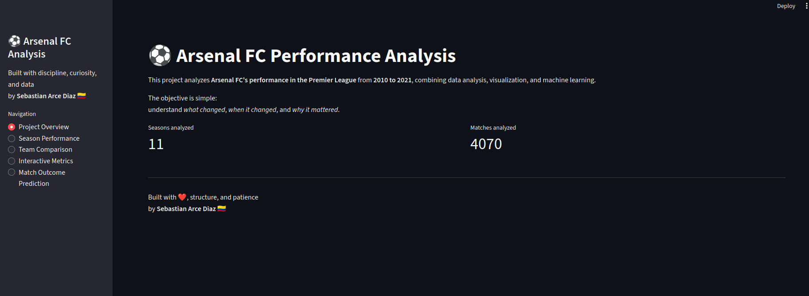

# 🏗️ Infrastructure & Data Portfolio

**Sebastian Arce Diaz** · Civil Engineer × CS Master's Student  
Railway Infrastructure · Construction Analytics · Python Automation

[](https://www.linkedin.com/in/sebastian-arce-diaz91/)


---

## 👋 About this repository

This portfolio applies **data engineering and software development** to problems I've lived as a civil and railway engineer.

Every project here is inspired by real challenges I encountered at Deutsche Bahn and on large infrastructure programmes — cost overruns, schedule slippage, reporting overhead, and the difficulty of making sense of messy project data under deadline pressure.

The goal: **turn raw project data into decisions**.

---

## 📂 Projects

### ⚽ Football Analytics

| Project | Description | Tech | Status |
|---------|-------------|------|--------|
| [Arsenal FC Performance Analysis](./football-analytics/arsenal-fc-analysis) | Interactive Streamlit dashboard analysing Arsenal's season performance: goals, xG, pass accuracy, defensive metrics. Scrapes live StatsBomb data. | Streamlit, Pandas, Plotly, StatsBomb API | [✅ Live](https://jahv3i5bsqmagxvzs9tvwb.streamlit.app/)|

> **Screenshot:**  
> 

---

### 🚆 Railway & Infrastructure Analytics *(incoming)*

| Project | Description | Tech | Status |
|---------|-------------|------|--------|
| Cost Deviation Tracker | Visualises planned vs actual costs across project phases. Flags deviation thresholds and produces PDF summary reports. | Pandas, Plotly, ReportLab | [✅ Live](https://tptuprkmq25qgjmvrbjftw.streamlit.app/) |
| Schedule Risk Dashboard | Monte Carlo simulation on activity durations to estimate P50/P80 completion dates. | NumPy, Plotly | 📋 Planned |
| Progress S-Curve Generator | Generates earned-value S-curves from raw progress data exports. | Pandas, Matplotlib | 📋 Planned |

---

### ⚙️ Construction Automation *(incoming)*

| Project | Description | Tech | Status |
|---------|-------------|------|--------|
| Automated Weekly Report Generator | Pulls data from Excel tracker → fills a Word template → emails it. Saves ~2 hours/week of manual work. | openpyxl, python-docx, smtplib | 🚧 In progress |
| Data Cleaning Pipeline | Cleans and normalises messy cost exports from SAP/primavera into analysis-ready DataFrames. | Pandas, regex | 📋 Planned |

---

## 🗂️ Repository Structure

```
infrastructure-data-portfolio/
│
├── football-analytics/
│   └── arsenal-fc-analysis/        ← ✅ complete
│
├── railway-analytics/
│   ├── cost-deviation-tracker/     ← 🚧 in progress
│   ├── schedule-risk-dashboard/    ← 📋 planned
│   └── s-curve-generator/          ← 📋 planned
│
├── construction-automation/
│   ├── report-generator/           ← 🚧 in progress
│   └── data-cleaning-pipeline/     ← 📋 planned
│
├── docs/
│   └── screenshots/                ← add project screenshots here
│
└── about-me/
    └── cv.md
```

---

## 🧠 Skills & Tools

**Data & Analysis:** Python · Pandas · NumPy · Scikit-learn  
**Visualisation:** Plotly · Matplotlib · Seaborn · Streamlit  
**Automation:** Selenium · BeautifulSoup · Playwright  
**Infrastructure domain:** Railway project management · Earned Value · Risk analysis · Deutsche Bahn standards  
**Languages:** Spanish (native) · English (fluent) · German (fluent)

---

## 🤝 Collaboration & Consulting

Interested in the intersection of infrastructure project management and data tooling. Open to conversations about research, collaboration, and future opportunities.

📬 [LinkedIn — Sebastian Arce Diaz](https://www.linkedin.com/in/sebastian-arce-diaz91/)
